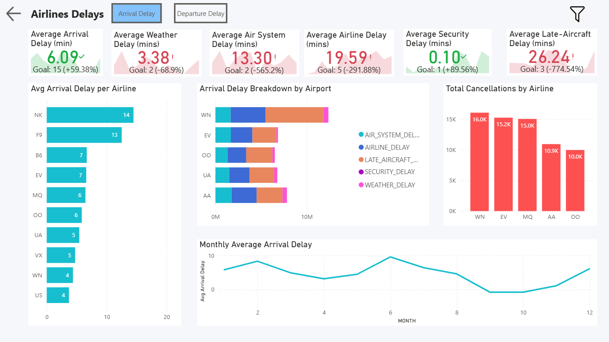

# US Flight Performance Analysis

An interactive Power BI dashboard analyzing 2015 US flight data to identify root causes of delays and cancellations. This project provides actionable insights for aviation operations management to improve on-time performance.

## Project Overview
This project focuses on analyzing flight reliability across the United States. By visualizing key performance indicators (KPIs) and delay distributions, it helps stakeholders understand whether delays are caused by weather, air system issues, or airline operations.

## Dataset
The analysis is based on the 2015 Flight Delays and Cancellations dataset. The data was processed from three distinct sources:
* **Flights:** Detailed records of scheduled vs. actual arrival and departure times.
* **Airlines:** Mapping of airline codes to full carrier names.
* **Airports:** Geographic information for origin and destination airports.

## Tools Used
* **Power BI:** Data visualization and report design.
* **Power Query:** Data cleaning, removing null values, and merging relational tables.
* **DAX:** Custom measures for On-Time Performance (%), Goal Tracking, and Average Delay durations.

## Key Insights
* **Target Gap:** On-Time Performance stands at 61.79%, failing to meet the 85.00% organizational goal.
* **Primary Cancellation Cause:** Weather accounts for over 54% of all cancellations, followed by Airline-specific issues at 28%.
* **Major Delay Drivers:** Late Aircraft Delays (26.24 min) and Airline Delays (19.59 min) are the largest contributors to total arrival delay time.
* **Critical Hubs:** ORD (Chicago) and DFW (Dallas) recorded the highest number of flight cancellations.

## Dashboard Preview
### 1. Performance Overview

### 2. Airport Delay Analysis

### 3. Airline Delay Analysis

## Business Value
The dashboard enables managers to move from reactive to proactive decision-making. By identifying that "Airline Delays" are nearly four times the target goal, the organization can prioritize internal process improvements and ground crew efficiency to reduce controllable costs.
